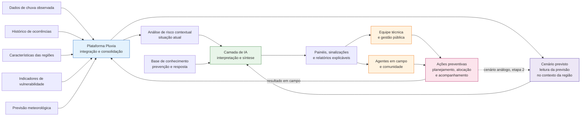

# 🌧️ Pluvia

### Monitoramento e apoio à decisão para prevenção de alagamentos urbanos
> Plataforma que consolida dados públicos de chuva observada e prevista, histórico de ocorrências e vulnerabilidade territorial, aplicando Inteligência Artificial para produzir análises contextuais de risco e para acompanhar as ações preventivas decorrentes dessas análises.

**GCC129 · Sistemas Distribuídos · 2026/2** · Parte 1: Concepção e Pitch

> ⚠️ A Pluvia **não** prevê alagamentos, **não** emite alerta oficial e **não** substitui a Defesa Civil. A plataforma utiliza previsões meteorológicas produzidas por órgãos oficiais como mais uma evidência, organiza esse conjunto, produz análises e apoia o planejamento de ações preventivas de rotina, como vistoria, inspeção e manutenção de drenagem, definidas pelo próprio município. A decisão e a resposta a emergências permanecem humanas e institucionais.

---

## 👥 Equipe

| Integrante | GitHub |
| ---------- | ------ |
| Augusto Fernandes Carvalho | [@AugustoFernandesc](https://github.com/AugustoFernandesc) |
| Alexandre Bortone | [@alebortone](https://github.com/alebortone) |
| Lucas Marcelino Neves | [@lucasnevesdv](https://github.com/lucasnevesdv) |
| Mark Leite Sá | [@markesapucai](https://github.com/markesapucai) |

---

## 🎯 O problema

Alagamentos e inundações urbanas ocorrem quando o volume de chuva, intenso ou acumulado, ultrapassa a capacidade de drenagem de uma região. A intensidade do impacto, porém, depende menos do evento em si do que do território que ele atinge: condições anteriores do solo, proximidade de cursos d'água, tipo de ocupação, infraestrutura disponível e capacidade de resposta da população afetada.

Esses eventos não são excepcionais no Brasil. Segundo os registros consolidados no [**Atlas Digital de Desastres no Brasil**](https://atlasdigital.mdr.gov.br), mantido pelo MIDR a partir do Sistema Integrado de Informações sobre Desastres (S2ID), os desastres de origem hidrológica respondem por 38,52% dos protocolos registrados no país entre 1991 e 2025, constituindo o segundo grupo mais recorrente, atrás apenas dos de origem climatológica (48,9%).

O recorte piloto do projeto é **Lavras/MG**, município de 104.761 habitantes (IBGE, Censo 2022). No mesmo Atlas, filtrando alagamentos, enxurradas e inundações, Lavras registra 11 ocorrências entre 1991 e 2025, com 1 óbito, 276 desabrigados ou desalojados e 3.077 afetados. São números modestos em escala nacional, e é justamente esse o ponto: municípios desse porte não aparecem nas manchetes e também não dispõem de equipe dedicada para consolidar a própria informação.

**O problema que a Pluvia endereça não é a ausência de dados, é a fragmentação deles.**

As informações necessárias para avaliar o risco de uma região existem, são públicas e têm boa qualidade. Mas estão distribuídas entre instituições distintas, com formatos, granularidades e periodicidades diferentes:

| Informação necessária | Onde está hoje |
| --------------------- | -------------- |
| Chuva observada e cenários de risco geo-hidrológico | [CEMADEN](https://www.gov.br/cemaden/pt-br) |
| Previsão meteorológica e acumulados previstos | [INMET](https://portal.inmet.gov.br) |
| Histórico oficial de ocorrências e impactos | [Atlas Digital de Desastres / S2ID](https://atlasdigital.mdr.gov.br) |
| Séries hidrológicas e monitoramento de corpos d'água | [ANA (HidroWeb/SNIRH)](https://www.snirh.gov.br/hidroweb/apresentacao) |
| População, domicílios, ocupação urbana e áreas precárias | [IBGE, Censo 2022](https://censo2022.ibge.gov.br) |
| Existência de instrumentos municipais de gestão de risco | [IBGE, MUNIC](https://www.ibge.gov.br/estatisticas/sociais/protecao-social/10586-pesquisa-de-informacoes-basicas-municipais.html) |

Consolidar esse conjunto exige tempo técnico, familiaridade com cada fonte e retrabalho constante. O resultado prático é que a decisão sobre **onde priorizar** drenagem, vistoria, comunicação ou preparação acaba sendo tomada com visão parcial do território, ou com base na memória de quem está no cargo.

Há ainda um segundo recorte do mesmo problema, que é temporal. A previsão meteorológica está disponível publicamente, mas chega ao município como um dado isolado: *"acumulado previsto de 80 mm nas próximas 24 horas"*. Sozinho, esse número não diz se aquilo é muito ou pouco **para aquele território**, nem o que fazer a respeito. Quem decide precisa cruzar a previsão com o que já aconteceu ali antes, e isso hoje depende inteiramente da memória de quem está no cargo.

**Em uma frase:** o dado existe, mas não chega consolidado, contextualizado e comparável até quem precisa decidir, nem com a antecedência necessária para agir antes da chuva.

---

## 🔍 Motivação

**1. O problema é estrutural, não pontual.** Eventos hidrológicos se repetem ano após ano e atingem municípios de todos os portes, como evidencia a série histórica do Atlas Digital de Desastres. Não se trata de responder a um episódio, mas a um padrão recorrente.

**2. A capacidade técnica municipal é desigual.** A [Pesquisa de Informações Básicas Municipais (MUNIC/IBGE, edição 2017)](https://www.ibge.gov.br/estatisticas/sociais/protecao-social/10586-pesquisa-de-informacoes-basicas-municipais.html) indica que 59,4% dos 5.570 municípios brasileiros não dispunham de instrumentos de planejamento e gerenciamento de riscos. Do lado do monitoramento federal, o CEMADEN monitora 1.295 municípios (referência de 17/03/2026), pouco menos de um quarto do total. Uma ferramenta que reduz o custo de análise vale mais justamente onde há menos equipe e menos cobertura.

**3. Prevenção exige antecedência.** Uma plataforma que só reage a dados observados chega atrasada: se a chuva já caiu, prevenção virou resposta. Incorporar a previsão meteorológica é o que permite que a análise aconteça **antes** do evento, que é a condição para que uma vistoria ou uma limpeza de drenagem sejam de fato preventivas.

**4. Os dados abertos já existem e são interoperáveis.** CEMADEN, INMET, MIDR, ANA e IBGE publicam dados acessíveis. Há, portanto, espaço para gerar valor por **integração e interpretação**, sem depender de instrumentação física própria, de coleta original nem de modelagem meteorológica própria, o que torna a proposta viável dentro do escopo de um trabalho de disciplina.

**5. O problema é naturalmente distribuído.** Fontes heterogêneas, volumes e disponibilidades distintos, atualizações assíncronas que precisam repercutir em várias partes do sistema, operações de negócio que atravessam vários contextos e necessidade de leitura otimizada para painéis formam um cenário adequado aos conteúdos da disciplina, e não um domínio adaptado à força para caber neles.

---

## 💡 A solução

A Pluvia executa seis movimentos:

**🔗 Integrar.** Coletar e normalizar dados públicos de chuva observada e prevista, ocorrências históricas, características do território e indicadores de vulnerabilidade em uma base comum e comparável por região.

**🧭 Contextualizar.** Relacionar as condições recentes de uma região ao seu próprio histórico e às suas características estruturais. O mesmo volume de chuva não significa a mesma coisa em territórios diferentes, e é esse contraste que a plataforma torna explícito.

**⏳ Antecipar.** Incorporar a previsão meteorológica oficial como mais uma evidência e traduzi-la em **cenário previsto** para cada região: o que o volume anunciado representa diante do padrão local, do histórico e das características do território. A Pluvia não produz previsão própria nem afirma que haverá alagamento. Ela interpreta uma previsão externa à luz do que já se sabe sobre aquele lugar.

**🤖 Analisar com IA.** Interpretar o conjunto consolidado, destacar regiões com sinais convergentes de atenção e produzir sínteses legíveis por quem não é especialista em dados.

**📣 Comunicar.** Entregar painéis, sinalizações de atenção e relatórios explicáveis, sempre indicando quais dados sustentam cada conclusão e qual a data de referência da previsão utilizada.

**🛠️ Acompanhar.** Permitir que a análise se converta em ação. A partir de uma sinalização de atenção, a equipe registra uma **ação preventiva** (vistoria, inspeção de bueiro, limpeza de canal, verificação de ponto crítico) com região, responsável, prazo e recursos alocados: equipe, veículo, equipamento. A plataforma acompanha a execução até a confirmação em campo e devolve o resultado ao histórico da região.

> Os movimentos **Antecipar** e **Acompanhar** são o que fecham o ciclo. O primeiro dá à ação preventiva um gatilho com antecedência; o segundo garante que a análise não termine em painel, e sim em providência rastreável cujo resultado volta a alimentar a base.

### O ciclo completo

```text
passado (histórico) → presente (chuva observada) → cenário previsto
        → sinalização de atenção → ação preventiva → resultado em campo
        → novo histórico
```

### Perfis de usuário

A plataforma atende dois públicos com necessidades distintas, o que se reflete em dois clientes diferentes:

| Perfil | Cliente | O que precisa |
| ------ | ------- | ------------- |
| **Equipe técnica / gestão pública** | Painel web | Visão comparativa entre regiões, histórico completo, cenário previsto por região, análises detalhadas, planejamento e acompanhamento de ações preventivas, alocação de equipes e recursos |
| **Agentes em campo e comunidade** | Aplicação leve / mobile | Informação sobre a própria região em linguagem simples, incluindo o que está previsto para os próximos dias, registro de ocorrências observadas, execução e confirmação das ações atribuídas |

### Princípios de projeto

- **Apoio, nunca substituição.** Acionamento de emergência e alerta oficial à população permanecem com os órgãos competentes.
- **Rastreabilidade.** Toda análise aponta fonte, período e, quando houver previsão envolvida, o horário de emissão do boletim utilizado.
- **Linguagem de atenção, não de previsão.** A plataforma indica que uma região _merece atenção_ e explica por quê. Nunca afirma que um alagamento ocorrerá.
- **Previsão é insumo, não produto.** A Pluvia consome previsão meteorológica oficial e não produz modelagem meteorológica própria.
- **Evidência, não imputação.** A plataforma apresenta o que está registrado. Ausência de ação preventiva registrada é declarada como ausência de registro, nunca como omissão do município.
- **Dados públicos por princípio.** O escopo inicial usa apenas fontes abertas e oficiais.

---

## 🗺️ Diagrama conceitual



_A previsão meteorológica entra como fonte da primeira versão. A linha tracejada indica o enriquecimento do cenário previsto pelo histórico de ações preventivas, que só se torna possível depois que a plataforma acumular registros próprios._

Diagrama **conceitual**, descrevendo o fluxo de informação. A arquitetura técnica (decomposição, comunicação e contratos) será definida na Parte 2.

---

## 📶 Camadas de maturidade

A incorporação da previsão é escalonada. Isso deixa explícito o que a primeira versão entrega e o que depende de acúmulo de dados próprios.

| Camada | O que a plataforma faz | Do que depende |
| ------ | ---------------------- | -------------- |
| **1. Cenário previsto** _(primeira versão)_ | Ingere a previsão oficial, apresenta o acumulado previsto por região e o compara ao padrão histórico local e às características do território, gerando sinalização de atenção com antecedência | Apenas das fontes públicas já mapeadas |
| **2. Cenário análogo** _(etapa seguinte)_ | Relaciona a previsão a eventos anteriores de intensidade semelhante na mesma região e às ações preventivas registradas naquele período | Volume mínimo de eventos e de ações registrados na própria plataforma |
| **3. Modelagem própria** _(fora do escopo do trabalho)_ | Modelos de previsão hidrológica próprios, sensoriamento local, integração com sistemas oficiais de alerta | Instrumentação, validação técnica e vínculo institucional |

> A camada 2 é limitada por dado, não por esforço de implementação. Com 11 ocorrências registradas em 34 anos no recorte piloto, a base de comparação começa pequena e cresce à medida que a plataforma é usada. Declarar isso é mais honesto do que apresentar comparação histórica robusta desde o primeiro dia.

---

## 🤖 Inteligência Artificial

A IA tem propósito específico dentro do domínio: **transformar um conjunto grande e heterogêneo de dados em uma leitura compreensível de contexto de risco.** Não é um chatbot acoplado à interface.

| Uso | O que faz | Por que exige IA |
| --- | --------- | ---------------- |
| **Leitura de contexto** | Avalia condições recentes de uma região à luz do seu histórico e características | Combina variáveis de naturezas diferentes, sem regra fixa válida para todo território |
| **Leitura de cenário previsto** | Interpreta o que o volume previsto representa para aquela região específica, considerando padrão local, território e vulnerabilidade | O mesmo acumulado previsto tem significados diferentes conforme o território; não há limiar único aplicável a todas as regiões |
| **Identificação de convergência** | Destaca regiões em que múltiplos indicadores apontam na mesma direção | O volume de regiões e de variáveis inviabiliza leitura manual sistemática |
| **Síntese explicável** | Produz resumo em linguagem natural do porquê de uma região aparecer em destaque | Torna a análise utilizável por quem não tem perfil técnico em dados |
| **Consulta à base de conhecimento** | Responde com apoio em material de referência sobre prevenção e resposta a eventos hidrológicos | Recuperação sobre documentos próprios do domínio, não conhecimento genérico |

### Exemplo de saída — situação atual

> **Região:** Centro
> **Precipitação recente:** elevada em relação à média histórica da região
> **Histórico:** ocorrências recorrentes registradas no período chuvoso
> **Território:** presença de área com ocupação vulnerável próxima a curso d'água
>
> **Análise:** a convergência entre chuva acumulada acima do padrão local, histórico recorrente e presença de população exposta indica uma situação que merece atenção e verificação em campo.
> _Fontes: CEMADEN (chuva, consulta em [data]); S2ID (ocorrências, 1991 a 2025); IBGE Censo 2022 (ocupação)._

### Exemplo de saída — cenário previsto

> **Região:** Centro
> **Cenário previsto:** acumulado de 80 mm em 24 h, previsto para [data]
> **Comparação local:** acima do padrão de precipitação diária registrado para a região no período chuvoso
> **Condição anterior:** solo com acumulado elevado nos últimos dias
> **Território:** ocupação vulnerável próxima a curso d'água
>
> **Análise:** o volume previsto é superior ao padrão local e ocorre sobre condição anterior de solo já saturado, em região com histórico de ocorrências. Recomenda-se verificar as condições dos pontos críticos e das estruturas de drenagem antes do período previsto.
> _Fontes: INMET (previsão, boletim emitido em [data/hora]); CEMADEN (chuva observada, consulta em [data]); S2ID (ocorrências, 1991 a 2025); IBGE Censo 2022 (ocupação)._

O usuário não recebe apenas um indicador, mas uma explicação contextualizada, acompanhada das fontes que a sustentam, o que permite contestação.

### Limites assumidos

- ❌ Não produz previsão meteorológica própria. Consome previsão publicada por órgão oficial.
- ❌ Não informa quando, onde ou com que intensidade um alagamento ocorrerá, nem afirma que ele ocorrerá.
- ❌ Não estabelece relação causal entre a realização de uma ação preventiva e a ausência de ocorrência posterior. Quando houver ambos os registros, a plataforma apresenta os fatos lado a lado, sem inferir causa.
- ❌ Não atribui omissão ao município. A ausência de ação preventiva no período é sempre declarada como *"não há ação registrada na plataforma"*.
- ❌ Não emite alerta oficial nem aciona resposta de emergência.
- ❌ Não substitui análise técnica, vistoria de campo ou julgamento da Defesa Civil.
- ✅ Toda saída acompanha as fontes que a originaram e a data de referência dos dados usados.

---

## 🌎 Impacto social

O impacto é **indireto e mediado**: a Pluvia melhora a informação disponível no momento da decisão, e é a decisão melhor informada que gera o efeito social.

### Quem é beneficiado, e de que forma

**Equipes técnicas e Defesa Civil municipal**
Visão consolidada do território sem o custo de reunir manualmente seis fontes distintas. Priorização de vistoria e verificação em campo apoiada em evidência comparável entre regiões, com antecedência em relação ao evento previsto.

**Gestores municipais**
Priorização mais defensável de recursos escassos, como limpeza de drenagem, obra e campanha de comunicação, com base em histórico organizado em vez de critério circunstancial. Memória institucional que permanece entre gestões.

**População em áreas expostas**
Ao incorporar indicadores de vulnerabilidade, a plataforma evita que a leitura de risco se restrinja ao aspecto físico do evento: o impacto de um alagamento depende de quem está exposto e de qual é a capacidade de resposta daquela comunidade. O ganho para a população é indireto, e chega pela decisão pública mais bem informada e pelo acesso a informação clara sobre a própria região, inclusive sobre o que está previsto.

**Sociedade civil e controle público**
Análises rastreáveis, baseadas em dados públicos, podem ser verificadas por conselhos, universidades e imprensa.

### 📏 Como o impacto será medido

**Cobertura e qualidade da informação**

- Número de regiões com base consolidada disponível.
- Número de fontes oficiais efetivamente integradas.
- Extensão do histórico de ocorrências consolidado por região.
- Percentual de análises com fonte e data rastreáveis _(meta: 100%)_.

**Eficiência do processo de análise**

- Tempo entre publicação de um dado na fonte e sua disponibilidade na plataforma.
- Tempo entre a publicação de um boletim de previsão e a atualização do cenário previsto nos painéis.
- Tempo para produzir um panorama de risco de uma região usando a plataforma, comparado ao tempo para produzi-lo manualmente, medido em ensaio controlado pela equipe.

**Utilidade percebida**

- Avaliação qualitativa das análises por avaliadores técnicos: clareza, utilidade e ausência de conclusões não sustentadas pelos dados.
- Proporção de regiões destacadas pela plataforma que, em revisão posterior, se mostram coerentes com o histórico conhecido.

**Ciclo de ação preventiva** _(disponível a partir do momento em que houver uso real)_

- Proporção de sinalizações de atenção que resultam em ação preventiva registrada.
- Antecedência média entre a sinalização baseada em cenário previsto e o período previsto do evento.
- Tempo entre a sinalização e a abertura da ação, e entre a abertura e a confirmação em campo.
- Proporção de ações concluídas em relação às abertas, por região.

> **Nota metodológica.** Não reivindicamos relação causal entre o uso da plataforma e a redução de danos por alagamento, porque estabelecer esse vínculo exigiria estudo longitudinal com grupo de comparação, fora do escopo do trabalho. Também não medimos "acerto de previsão", porque a previsão não é produzida pela plataforma e a Pluvia não afirma que um alagamento ocorrerá. As métricas avaliam a **qualidade, a tempestividade e a utilidade da informação produzida**, que é o que a Pluvia efetivamente entrega.

---

## 📚 Dados e referências

Todas as fontes são institucionais e de dados oficiais. Cada uma sustenta um ponto específico da proposta:

**1. CEMADEN: Centro Nacional de Monitoramento e Alertas de Desastres Naturais (MCTI)**
Monitoramento de áreas de risco, rede nacional de pluviômetros e publicação de cenários de risco geo-hidrológico considerando condições atuais e previsão de chuva.
→ _Sustenta:_ a caracterização técnica do fenômeno e a fonte primária de dados de precipitação observada.
🔗 https://www.gov.br/cemaden/pt-br · Mapa interativo: https://mapainterativo.cemaden.gov.br

**2. INMET: Instituto Nacional de Meteorologia**
Previsão meteorológica oficial, boletins de acumulado previsto e dados observados das estações automáticas.
→ _Sustenta:_ a camada de cenário previsto, que dá antecedência à sinalização de atenção e ao planejamento das ações preventivas.
🔗 https://portal.inmet.gov.br

**3. MIDR: Atlas Digital de Desastres no Brasil / S2ID**
Consolidação dos registros oficiais de desastres, com recorte por município, período e tipologia (inundação, enxurrada, alagamento).
→ _Sustenta:_ a recorrência do problema no Brasil e a base do histórico de ocorrências da plataforma.
🔗 https://atlasdigital.mdr.gov.br · https://s2id.mi.gov.br

**4. ANA: Agência Nacional de Águas e Saneamento Básico**
Rede Hidrometeorológica Nacional, séries históricas de nível e vazão (HidroWeb/SNIRH) e relatórios de Conjuntura dos Recursos Hídricos no Brasil.
→ _Sustenta:_ a dimensão hidrológica do risco e a fonte de dados sobre corpos d'água.
🔗 https://www.gov.br/ana/pt-br · https://www.snirh.gov.br/hidroweb/apresentacao

**5. IBGE: Instituto Brasileiro de Geografia e Estatística**
Censo Demográfico 2022, malhas territoriais, classificação de aglomerados subnormais e a Pesquisa de Informações Básicas Municipais (MUNIC), que investiga instrumentos municipais de gestão de risco.
→ _Sustenta:_ os indicadores de vulnerabilidade e território, e a desigualdade de capacidade técnica entre municípios.
🔗 https://www.ibge.gov.br · https://censo2022.ibge.gov.br

### Política de uso de dados

- Nenhuma estatística é apresentada sem origem verificável na fonte citada.
- Números usados no pitch trazem **fonte, recorte territorial e período de referência**, conferidos diretamente no portal da instituição.
- Toda informação derivada de previsão registra o **horário de emissão do boletim** utilizado, porque previsões são revisadas ao longo do dia e uma análise só é auditável se for possível saber sobre qual versão ela foi produzida.
- Fontes jornalísticas, quando usadas, entram como complemento ilustrativo, nunca como base da fundamentação.

**Dados verificados utilizados nesta proposta:**

| Afirmação a sustentar | Valor | Fonte | Recorte / período | Consulta em |
| --------------------- | ----- | ----- | ----------------- | ----------- |
| Participação dos desastres hidrológicos no total de protocolos | 38,52% (2º grupo mais recorrente) | Atlas Digital de Desastres | Brasil, 1991 a 2025 | 17/09/2026 |
| Ocorrências de alagamento, enxurrada e inundação no recorte piloto | 11 | Atlas Digital de Desastres | Lavras/MG, 1991 a 2025 | 17/09/2026 |
| População residente no recorte piloto | 104.761 | IBGE, Censo 2022 | Lavras/MG, 2022 | 17/09/2026 |
| Municípios sem instrumentos de planejamento e gerenciamento de riscos | 59,4% de 5.570 | IBGE, MUNIC 2017 | Brasil, 2017 | 17/09/2026 |
| Municípios monitorados pelo CEMADEN | 1.295 | CEMADEN/MCTI | Brasil, referência de 17/03/2026 | 17/09/2026 |

Os filtros do Atlas Digital são rotulados por nome de tipo de desastre e não exibem os códigos COBRADE na interface, portanto a contagem acima corresponde aos filtros *Alagamentos*, *Enxurradas* e *Inundações* como nomeados no próprio portal.

---

## 🚀 Objetivo

**Geral.** Desenvolver uma plataforma distribuída que integre dados públicos sobre chuva observada e prevista, histórico de ocorrências e vulnerabilidade territorial, aplicando Inteligência Artificial para produzir análises contextuais de risco de alagamento, incluindo a leitura de cenários previstos, e que permita planejar e acompanhar as ações preventivas decorrentes dessas análises.

**Específicos**

1. Caracterizar o problema com base em fontes institucionais brasileiras.
2. Mapear as fontes oficiais relevantes, incluindo as de previsão meteorológica, e avaliar sua disponibilidade, granularidade e formato de acesso.
3. Definir o modelo conceitual da solução e seu fluxo de informação.
4. Delimitar o papel da IA como camada de interpretação, com limites explícitos, distinguindo interpretação de previsão de produção de previsão.
5. Estabelecer critérios de avaliação da qualidade da informação produzida.
6. _(etapas seguintes)_ Projetar e implementar a plataforma como sistema distribuído.

---

## 🧩 Escopo inicial

### Capacidades previstas para a primeira versão

- Cadastro e consulta de regiões monitoradas.
- Ingestão e acompanhamento de dados de chuva observada a partir de fontes públicas.
- Ingestão periódica de previsão meteorológica oficial e associação às regiões monitoradas.
- Composição do **cenário previsto** por região, comparando o acumulado previsto ao padrão histórico local e às características do território.
- Registro, validação e consulta de ocorrências.
- Consolidação e visualização do histórico por região.
- Composição de um panorama de risco contextual por região.
- Sinalizações de atenção dirigidas aos perfis de usuário, disparadas tanto por condição observada quanto por cenário previsto.
- Planejamento de ações preventivas, com alocação de equipe, prazo e recursos.
- Acompanhamento da execução até a confirmação em campo, com retorno ao histórico da região.
- Análise contextual explicável com apoio de IA.

### Por que o domínio sustenta um sistema distribuído

O domínio não se resume a consultar dados. Ele contém **operações de negócio compostas**, que atravessam vários contextos, comprometem recursos limitados e precisam ser desfeitas por inteiro quando uma etapa falha. Contém também **fluxos assíncronos de atualização** que precisam repercutir em várias partes do sistema sem bloquear quem está consultando.

**Abertura de uma ação preventiva.** É a operação central do sistema. A partir de uma sinalização de atenção, a equipe abre uma ação para uma região: a ação é criada com prazo e responsável, uma equipe é alocada, um recurso é reservado (veículo, equipamento de desobstrução, janela de agenda), o compromisso é registrado no planejamento da região e os envolvidos são notificados. São recursos **finitos e disputados**, já que a mesma equipe não pode estar em duas ações no mesmo turno.

Se a alocação falhar em qualquer ponto, ou se a ação for cancelada depois de aberta, tudo precisa ser desfeito de verdade: a equipe volta a ficar disponível, o equipamento é liberado para outra ação, a janela de agenda é devolvida e o planejamento da região reflete o cancelamento. Manter recurso reservado para uma ação que não vai acontecer trava a operação de um município que já tem pouca equipe. A compensação tem consequência real, não é apenas um `DELETE`.

A previsão aumenta a pressão sobre essa operação: quando um cenário previsto sinaliza várias regiões para a mesma janela de tempo, a disputa pelos mesmos recursos escassos deixa de ser hipótese e passa a ser o caso comum.

**Atualização de previsão.** Boletins meteorológicos são republicados e revisados ao longo do dia. Cada nova publicação precisa ser ingerida, associada às regiões, recompor o cenário previsto, atualizar os modelos de leitura dos painéis e eventualmente gerar nova sinalização, tudo sem bloquear quem está consultando o sistema. É um fluxo naturalmente assíncrono, com consistência eventual aceitável e defasagem mensurável entre a publicação na fonte e a visibilidade no painel.

**Validação de uma ocorrência reportada.** Uma ocorrência observada em campo é registrada, passa por validação técnica, é incorporada ao histórico da região, altera o panorama de risco e dispara comunicação aos perfis interessados, podendo inclusive originar uma ação preventiva. Se a validação for revertida, o histórico, o panorama e a ação dela derivada precisam ser revertidos em conjunto.

**Encerramento de uma ação em campo.** A confirmação de execução libera os recursos alocados, registra o resultado no histórico da região e atualiza o panorama, o que fecha o ciclo e alimenta a análise seguinte.

Há ainda uma assimetria clara entre **escrita** (ingestão contínua de dados observados e previstos, registro de ocorrências, movimentação de ações) e **leitura** (painéis comparativos, consultas históricas, buscas por região), com exigências de desempenho e modelagem bastante diferentes de cada lado.

> A decomposição em serviços, os contratos, os padrões aplicados e as decisões arquiteturais serão definidos e justificados na **Parte 2**. Esta seção existe apenas para demonstrar que o domínio comporta essa complexidade.

### Fora do escopo desta etapa

- Arquitetura técnica, decomposição em serviços, contratos de API e modelo de dados.
- Implementação, instrumentação física ou coleta própria de dados.
- Modelagem meteorológica ou hidrológica própria.
- Integração com sistemas oficiais de alerta.

### Premissas e limitações reconhecidas

- Utilização exclusiva de dados públicos e abertos.
- A qualidade da análise é limitada pela cobertura e atualização das fontes públicas.
- A qualidade do cenário previsto é limitada pela qualidade e pela granularidade da previsão oficial. Previsões são revisadas e podem não se confirmar, e a plataforma não assume responsabilidade por elas.
- A granularidade espacial disponível pode ser municipal, e não por bairro. Nesse caso, a diferenciação entre regiões passa a vir do território e do histórico, e não do volume previsto, limitação que será declarada na própria interface.
- O sub-registro de ocorrências é problema conhecido em bases de desastres e afeta qualquer leitura histórica, especialmente a comparação com eventos semelhantes prevista para a camada 2.
- Regiões com menor densidade de monitoramento terão análises menos precisas, limitação que será declarada na própria interface.
- Recorte territorial piloto restrito a **Lavras/MG**, escolhido por ser o município da instituição, ter porte tratável e possuir registro histórico no Atlas Digital. A restrição é intencional, para permitir validação de qualidade antes de qualquer generalização. Dessa forma, começamos com mais qualidade.

---

## ⚙️ Execução do projeto

> Ainda não há código nesta etapa. As instruções completas para subir o sistema do zero serão publicadas nesta seção a partir da Parte 3, junto com os arquivos de containerização.

---

## 🤝 Como colaboramos neste repositório

Convenções adotadas pela equipe desde a Parte 1:

- **Branches por funcionalidade**, integradas exclusivamente por _pull request_.
- **Todo PR exige ao menos um code review aprovado** por outro integrante. Não fazemos auto-merge.
- **Identidade Git configurada** por cada integrante (`user.name` e `user.email` correspondentes à conta do GitHub), para que a autoria dos commits seja atribuída corretamente.
- **Trabalho em par registrado** com `Co-authored-by:` na mensagem do commit.
- **Commits distribuídos ao longo do semestre**, acompanhando o avanço real do trabalho.

```bash
# configuração individual, executada por cada integrante
git config user.name  "Nome Sobrenome"
git config user.email "email-da-conta@github.com"
```

---

## 📁 Organização do repositório

```text
pluvia/
├── README.md              # Este documento, proposta da Parte 1
└── docs/
    └── referencias.md     # Fichamento das fontes institucionais
    └── logoPluvia.png     # Logo do projeto
```

Os diagramas de arquitetura, as decisões técnicas e os contratos de API serão adicionados a `/docs` a partir da Parte 2, conforme forem produzidos.

---

<sub>Projeto acadêmico, disciplina GCC129, Sistemas Distribuídos, 2026/2. Pluvia é uma startup fictícia criada para fins didáticos.</sub>
